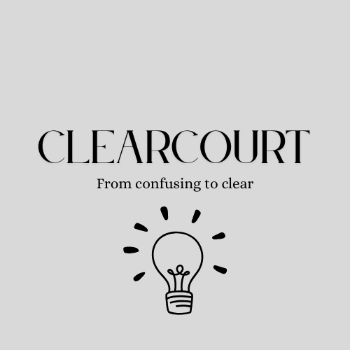

  
  
From Confusing to Clear

  Hi there! I built ClearCourt because I know how confusing legal papers can be. Ever get a letter you just don't understand? Most of us have! That's where ClearCourt comes in.

  It's super easy to use. Just upload your legal document – a court letter, a notice, anything really. ClearCourt will quickly read it and tell you in plain, simple words what it all means. You'll understand the main points, what you need to do, and any important dates. No more guessing!

  My goal is to make things less stressful for you. I want everyone to feel confident understanding their legal documents. ClearCourt is here to help clear things up!

  **Disclaimer:** ClearCourt provides general information, not legal advice. Always consult a qualified lawyer for your specific legal needs.

